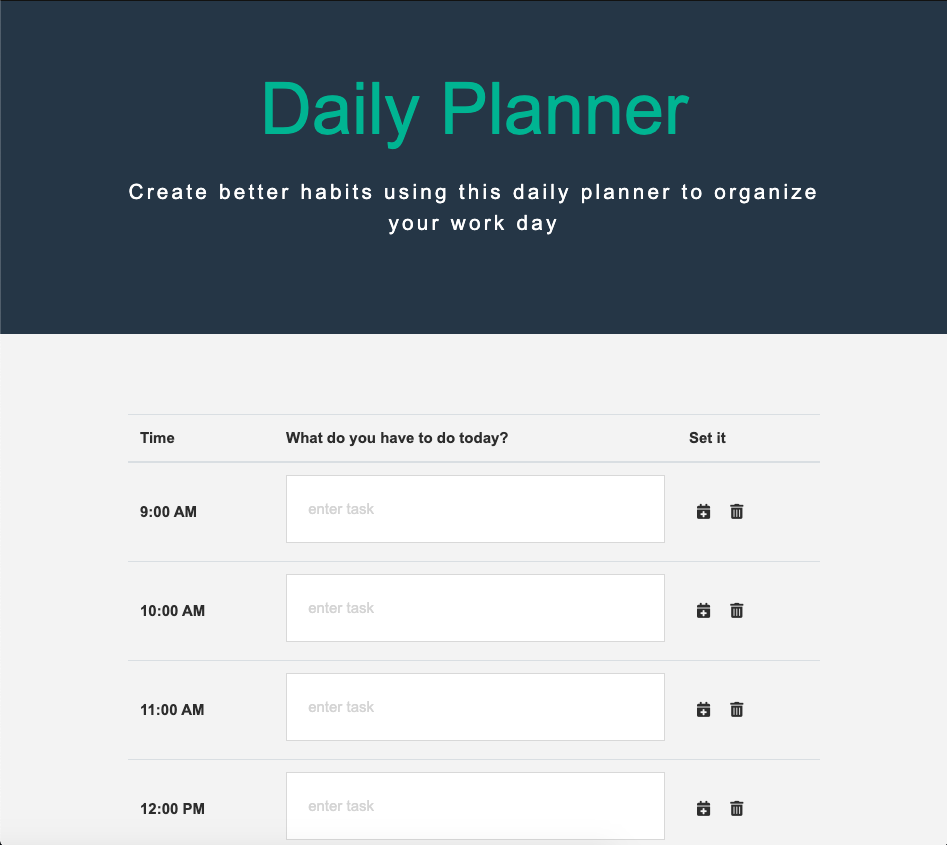

# DayPlanner-App

Created a simple day planner application that allows the user to save events for each hour of the day. This app will run in the browser and feature dynamically updated HTML and CSS powered by jQuery. This app also uses localStorage to save the events in browser and remove events individually. 

### Author: Bisraddesign (Brad Thompson)

## Acceptance Criteria:

- GIVEN I am using a daily planner to create a schedule
- WHEN I open the planner
- THEN the current day is displayed at the top of the calendar
- WHEN I scroll down
- THEN I am presented with timeblocks for standard business hours
- WHEN I view the timeblocks for that day
- THEN each timeblock is color coded to indicate whether it is in the past, present, or future
- WHEN I click into a timeblock
- THEN I can enter an event
- WHEN I click the save button for that timeblock
- THEN the text for that event is saved in local storage
- WHEN I refresh the page
- THEN the saved events persist

## Programming 

Utilized Bootstrap4, Jquery, Html, css, and moment.js

- <https://getbootstrap.com/>
- <https://bootswatch.com/>
- <https://momentjs.com/>

## Deployment Link

<https://bisrad.github.io/Day_Planner-app/>

## Credits:

- Andrew Moses | provided insight into moment.js and localStorage usibility 
- Joey Jepson  | provided a basic template to accelerate my developement process 

## Rescorces:

- StackOverflow | for further examples of JS time and localStorge Uses. Also helped in understanding addClass 
                  issues and key removal.
